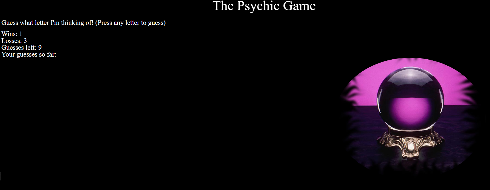

# Psychic-Game
A game where you have to guess the letter!

A fun activity that helps you understand how to pull from and push to arrays.

It can help you understand how simple games make choices based on if/else statements and how to reset a game without refreshing the page.

# Preview

# Check out the site here:

https://grimblelewis.github.io/Psychic-Game/
